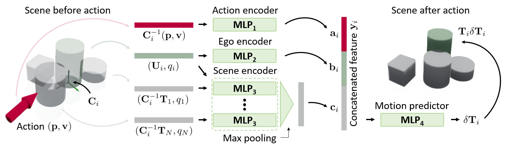

# SuperQuadric Pushing Dynamics Network (SQPD-Net)
The official repository for \<SE(2)-Equivariant Pushing Dynamics Models for Tabletop Object Manipulations\> (Seungyeon Kim, Byeondgo Lim, Yonghyeon Lee, and Frank C. Park, CoRL 2022).

> This paper proposes a SE(2)-equivariant pushing dynamics model for tabletop object manipulations. Our dynamics model is then used for various downstream pushing manipulation tasks such as the object moving, singulation, and grasping.

- *[Openreview](https://openreview.net/forum?id=4g3PwAp5nsX)* 
- *[Paper](https://openreview.net/pdf?id=4g3PwAp5nsX)* 
- *[Supplementary video](https://youtu.be/OLoAHhf7vk0)*

## Preview
### SE(2)-Equivariant Pushing Dynamics Models

<I>Figure 1: SE(2)-equivariant pushing dynamics neural network architecture for an $i$-th object, $f_i$. </I>

### Pushing Manipulation using SQPD-Net

<I>Figure 2: Real-world manipulation results using SQPD-Net for moving, singulation, and grasping tasks (for the fourth row case, the target object is the cylinder surrounded by the three cubes). The red arrow at each recognition step means the optimal pushing action. </I>

## Requirements
### Environment
The project is developed under a standard PyTorch environment.
- python 3.9
- pybullet 3.2.3
- pytorch
- tensorboardx
- tqdm
- h5py
- Open3D
- scipy
- scikit-learn 
- opencv-python
- imageio
- matplotlib
- scikit-image
- dominate
- numba

### Datasets
Datasets should be stored in `datasets/` directory. Datasets can be downloaded through the [Google drive link](https://drive.google.com/drive/folders/15Gr1TgaUfAB0YBoeSA_T1yXsnTmVfklH?usp=sharing). After set up, the `datasets/` directory should be as follows.
```
datasets
├── pushing_object_num_1
|   ├── training
|   ├── validation
|   └── test
├── pushing_object_num_2
|   ├── training
|   ├── validation
|   └── test
├── pushing_object_num_3
|   ├── training
|   ├── validation
|   └── test
└── pushing_object_num_4
    ├── training
    ├── validation
    └── test
```

- If you want to generate your own custom dataset, run the following script:
```shell
python data_generation.py --enable_gui                # PyBullet UI on/off
                          --folder_name test          # folder name of the generated dataset
                          --object_types box cylinder # used object types for data generation
                          --num_objects 4             # can be 1~4; currently the max number of object is 4
                          --push_num 20               # max number of pushing per sequence
                          --training_num 150          # the number of training set; total number of training set is (training_num * push_num)
                          --validation_num 15         # the number of validation set; total number of validation set is (validation_num * push_num)
                          --test_num 15               # the number of test set; total number of test set is (test_num * push_num)
```

### Pretrained model
Pre-trained models should be stored in `pretrained/`. The pre-trained models are already provided in this repository. After set up, the `pretrained/` directory should be follows.
```
pretrained
├── segmentation_config
│   └── pretrained
│       ├── segmentation_config.yml
│       └── model_best.pkl
├── sqpdnet_2d_motion_only_config
│   └── pretrained
│       ├── sqpdnet_2d_motion_only_config.yml
│       └── model_best.pkl
└── recognition_config
    └── pretrained
        ├── recognition_config.yml
        └── model_best.pkl
```

## Running
### Training
The training script is `train.py`. 
- `--config` specifies a path to a configuration yml file.
- `--logdir` specifies a directory where the results will be saved.
- `--run` specifies a name for an experiment.
- `--device` specifies an GPU number to use.

Training code for recognition network and segmentation network is as follows:
```
python train.py --config configs/sqpdnet/{X}_config.yml
```
- `X` is either `segmentation` or `recognition`. 
- If you want to see the results of the intermediate training process in tensorboard, run this code:
  ```
  tensorboard --logdir train_results/{X}_config --host {ip address}
  ```

Training code for motion prediction network is as follows:
```
python train.py --config configs/sqpdnet/sqpdnet_{X}_motion_only_config.yml
```
- `X` is either `2d` or `3d`. 
- If you want to see the results of the intermediate training process in tensorboard, run this code:
  ```
  tensorboard --logdir train_results/sqpdnet_{X}_motion_only_config --host {ip address}
  ```
- If you want to see the overall pushing dynamics dataset in tensorboard, run this code:
  ```
  python dataset_visualizer.py --config configs/data_visualization/data_visualization.yml
  tensorboard --logdir train_results/data_visualization --host {ip address}
  ```

### Control in Simulation Environment
The control scripts in Pybullet simulator are as follows:
```
python control.py --config configs/control_sim/control_sim_{X}_config.yml
```
- `X` is either `moving`, `singulation`, `grasping_clutter`, `grasping_large`, or `moving_interactive`.
  - `moving` is a task to move objects to their desired poses.
  - `singulation` is a task to separate objects by more than a certain distance $\tau$.
  - `grasping_clutter` is a task to make a target object graspable in cluttered environment by pushing manipulation.
  - `grasping_large` is a task to make a large and flat target object graspable by pushing manipulation.
  - `moving_interactive` is a task to move an object to its desired pose, but the robot should not push the target object.

### Control in Real-world Robot Environment
The control scripts in real-world environment are as follows:
```
python control.py --config configs/control_real/control_real_{X}_config.yml --ip {Y} --port {Z}
```
- The real-world control code is based on python socket communication library between sever computer (python 3) and robot computer (python 2).
- A simple python guideline for communicating with server from robot computer is as follows.
  ```python
  from function.communicator_client import Talker
  
  # Connect to server
  client = Talker({Y}, {Z})
  client.conn_server()

  # Send vision data
  client.send_vision(point_cloud)           # send point cloud (n x 3)

  # Receive data from server
  data = client.recv_grasp(dict_type=True)  # receive pushing or grasping action
  ```
- `Y` is ip address of the server computer and `Z` is a port number.
- `X` is either `moving`, `singulation`, `grasping_clutter`, `grasping_large`, or `moving_interactive`. 
  - The task descriptions are the same with above.

### (Optional) Training Baselines
Training code for pushing dynamics model baselines is as follows:
```
python train.py --config configs/baseline/{X}_config.yml
```
- `X` is either `2dflow`, `se3-nets`, `se3_pose_nets`, `3dflow`, or `dsr_net_single`. 

## Citation
If you found this repository useful in your research, please consider citing:
```
@inproceedings{kimse,
  title={SE (2)-Equivariant Pushing Dynamics Models for Tabletop Object Manipulations},
  author={Kim, Seungyeon and Lim, Byeongdo and Lee, Yonghyeon and Park, Frank C},
  booktitle={6th Annual Conference on Robot Learning}
}
```

## Acknowledgement
We thank the authors for releasing the code.
- The pushing data generation code is modified from [dsr](https://github.com/columbia-ai-robotics/dsr).
- The baseline models are from [se3posenets-pytorch](https://github.com/abyravan/se3posenets-pytorch) for 2DFlow, SE3-Net, and SE3Pose-Net and from [dsr](https://github.com/columbia-ai-robotics/dsr) for 3DFlow and DSR-Net.
- The segmentation and recognition code is modified from [DSQNet-public](https://github.com/seungyeon-k/DSQNet-public).